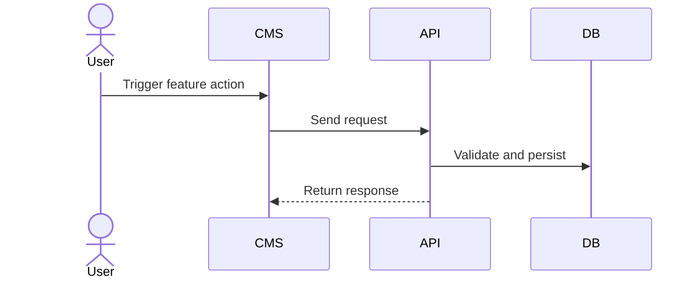
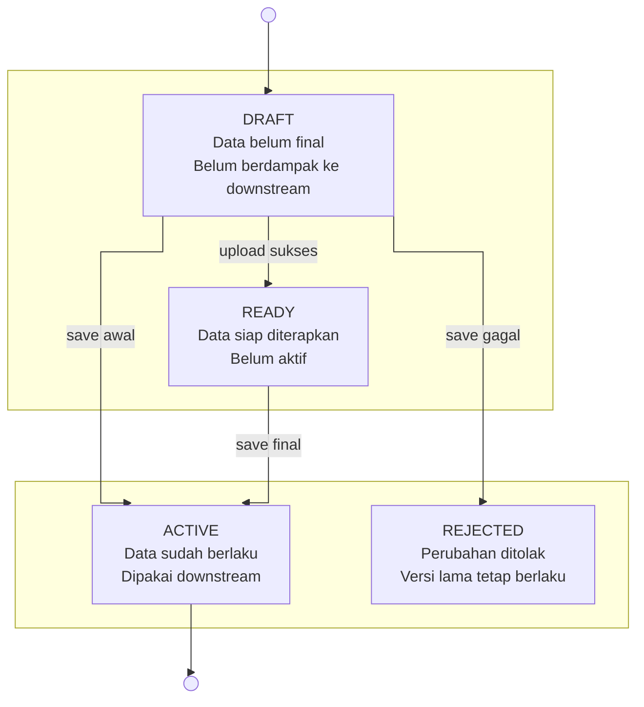

# Output Template

Use this template when writing the final solutioning document. Replace placeholders with domain-specific content and remove any helper notes.

Write the document in Bahasa Indonesia unless the user explicitly asks for English.

## Objective Overview

- Describe the feature goal in business terms.
- Name the primary actor and the system outcome.
- Mention important lifecycle or downstream effects when visible from the UI.

## Ringkasan Alur & Cara Kerja Sistem

- Summarize the end-to-end flow from UI action to backend processing.
- Explain validation, persistence, and asynchronous side effects when relevant.
- Keep this as a narrative system flow, not a user-story list.

## Business Rules

- List explicit and inferred rules that materially affect backend behavior.
- Include validation, uniqueness, permissions, dependencies, activation or deactivation impact, quota logic, or deletion rules when relevant.

## Table Design

Create one subsection per table or aggregate.

Suggested shape:

### `table_name`

Purpose: one-sentence purpose.

| Field | Type | Constraint | Notes |
| --- | --- | --- | --- |
| `id` | `UUID` | PK | Primary identifier |

Include:

- master tables
- transactional tables
- history or ledger tables
- async execution tables if the feature clearly needs them

## Sequence Diagram

Write a Mermaid sequence diagram for the most important lifecycle, usually create, submit, approve, update, delete, or fetch.



## State Diagram

Write a Mermaid state diagram only for the feature's lifecycle state, not for page navigation.

Prefer a business-state card style:

- each node should be a persisted or business-meaningful state
- include the state name and short descriptive lines inside the node when possible
- mention important business effects such as lock status, inventory effect, version effect, approval wait, or downstream usage when relevant
- label transitions with the actual business trigger
- do not reduce the diagram to generic request phases like `LOADING`, `UPLOADING`, or `SAVING` unless that is truly the domain lifecycle
- if `stateDiagram-v2` creates a circular or noisy layout, switch to `flowchart TB` or `flowchart LR` and render each state as a card-like node
- prefer a top-to-bottom or left-to-right reading path that mirrors the business workflow
- use `subgraph` rows or columns to lock card placement when needed, especially if the target format resembles a manually arranged workflow map
- when rigid connectors are preferred, add Mermaid init config like `%%{init: {'flowchart': {'curve': 'stepBefore'}}}%%` to reduce curved lines
- if arrows still collide, use an outer `flowchart TB` with 2-3 inner `LR` rows so the main path reads horizontally and the diagram descends by outcome
- keep success states together and failure or rejection states together to minimize crossing connectors
- prefer fewer, clearer recovery arrows over showing every possible back-reference



## API Contract

Create one subsection per endpoint.

Minimum fields per endpoint:

- endpoint purpose
- method and path
- authorization
- path params, query params, and request body when relevant
- validation rules
- success response
- negative cases
- each negative case should be a short status-title line followed by `Example response:` and a JSON example

Prefer a shape like:

### Create Feature

- URL: `POST /feature/v1`
- Auth: `Bearer Token`
- Request Body:

```json
{
  "name": "Example"
}
```

- Success Response:

```json
{
  "status": {
    "code": "FEAT20101",
    "message": "Feature created."
  },
  "data": {
    "id": "uuid"
  }
}
```

## Table Status Code

Use a concise table with these columns:

| HTTP Status | Internal Code | Title | Description |
| --- | --- | --- | --- |
| 400 | `FEAT40001` | Validation Error | Request payload is invalid. |

Keep this table consistent with all negative cases used in the API contract.
